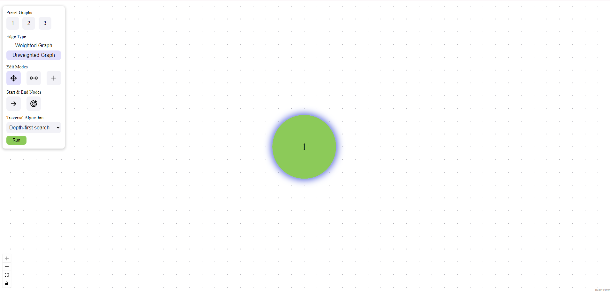
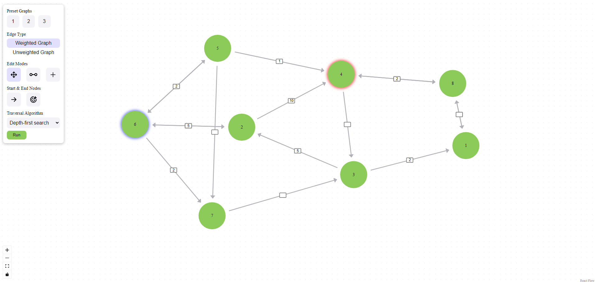
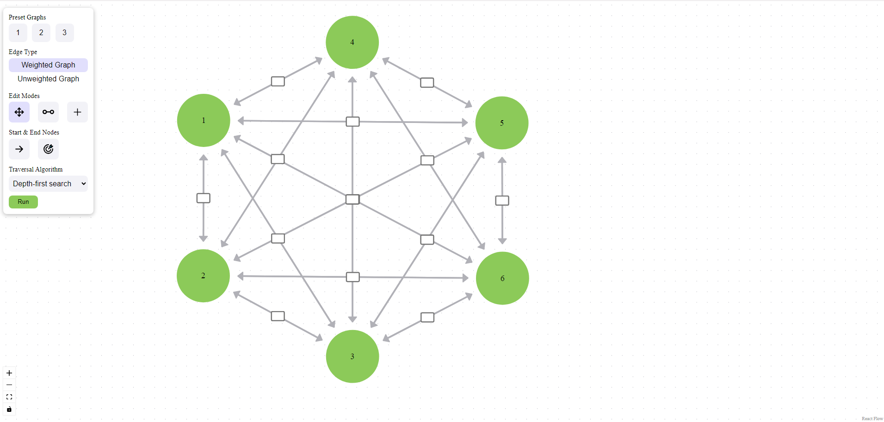

# PathFinder Visualizer

## Purpose

PathFinder Visualizer is designed to help visualize and interact with graph-based algorithms, particularly pathfinding algorithms like Dijkstra, A*, and BFS (and other algorithms soon). The goal of this project is to provide an intuitive interface for users to experiment with graph structures, understand how algorithms traverse and explore nodes.

The frontend is built using **React Flow** for flexible graph rendering, while a **Spring Boot** backend will be integrated soon to support more advanced features like graph persistence, algorithm execution, and real-time updates.

## Features

- **Interactive Node Creation**: Create, move, and delete nodes freely on the graph. Nodes are automatically labeled starting from 1 for easy identification.
- **Start/End Node Marking**: Mark specific nodes as the starting and ending points of your pathfinding algorithm.
- **Edge Creation**: Manually add edges between nodes to define the graph's structure. Edges can represent weighted or unweighted connections.
- **Visualize Algorithms**: Future updates will enable the visualization of different pathfinding algorithms in real-time, showing how each algorithm explores the graph.

## Demo (Update: 4/3/2025)

Currently still in progress:

## Todo (Frontend)

- Make the toolbox more responsive for a smoother user experience.
- Potential bug fixes
- [For later] Reconsider UI choice for start/end node selection to improve usability.
- [For later] Explore new ways of adding and managing nodes to simplify interaction.

## Backend (Future)

- **Spring Boot Integration**: The backend will be powered by Spring Boot for the execution of pathfinding algorithms, saving/loading graph structures, and maybe enabling multiplayer graph collaboration. JGraphT will be utilized to run these algorithms
- **Real-time Algorithm Execution**: The backend will handle the complex computations, such as calculating the shortest path, while the frontend will provide real-time updates and visualizations. This will include pauses, slow-motion etc.
